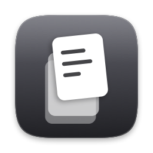

<div align="center">



# Yank

**Menu bar clipboard history for macOS, with instant search.**

Native Swift · Zero dependencies · No permissions required

[](https://github.com/ramacharanreddy-k/yank-clip/actions/workflows/ci.yml)

</div>

---

Yank remembers what you copy. Click the menu bar icon, type to filter, click a
clip — it goes back on your clipboard, ready to paste.

## Install

Requires macOS 14+ and a Swift 6 toolchain. **Xcode is not needed** — Command
Line Tools are enough.

```bash
git clone https://github.com/ramacharanreddy-k/yank-clip.git
cd yank-clip
make install
```

That builds an optimised `.app`, ad-hoc signs it, and copies it to
`/Applications`. Open it, then turn on **Launch at login** in Settings.

Gatekeeper won't complain: the "unidentified developer" prompt comes from a
quarantine flag applied to *downloaded* files, and a locally compiled binary
doesn't carry one.

> Launch at login needs the app in `/Applications` — `SMAppService` is fussy
> about ad-hoc signed apps elsewhere. If the toggle fails, Settings shows the
> actual error rather than silently doing nothing.

`make run` builds and launches without installing.

## Using it

Click the menu bar icon, then:

- **Type** to filter
- **Click a clip**, or press **⌘1**–**⌘9** / **⌘0**, to put it on the clipboard
- Press **⌘V** yourself — Yank never pastes for you, which is what keeps it
  free of the Accessibility permission
- **Hover a row** for its delete button; **Clear All** empties the history

Shortcuts work only while the menu is open. They are not global hotkeys.

Re-copying something already in the history moves it to the top instead of
adding a duplicate. Settings has four tabs — how much to remember and show,
appearance, a searchable browser of everything stored, and About.

## Privacy

This app watches your clipboard, so it is worth being precise.

| | |
|---|---|
| **Permissions** | None. Not even Accessibility. |
| **Network** | None. Nothing ever leaves the machine. |
| **Password managers** | Skipped — copies marked `org.nspasteboard.ConcealedType` or `TransientType` are never recorded. This is the convention 1Password, Bitwarden and others use to opt out. |
| **Stored at** | `~/Library/Application Support/Yank/history.json` |
| **Permissions on it** | `0600`, inside a `0700` directory — your account only |
| **Contents** | Text only. Images and files are ignored. |

`make purge` deletes the history and preferences.

## Development

```bash
make            # list every target
make check      # the gate: builds sources and tests, fails on any warning,
                # then runs the suite
```

| Target | |
|---|---|
| `make build` / `make release` | assemble the `.app` |
| `make run` | build release and launch, replacing a running copy |
| `make debug-run` | run in the terminal so `print()` and `os_log` reach stdout |
| `make test` | run the suite |
| `make test-filter FILTER=ClipStore` | run one suite |
| `make icons` / `make preview` | redraw the icon; open a review sheet |
| `make clean` | remove build products |
| `make purge` | ⚠️ also deletes saved history and preferences |

### Tests

124 tests in 16 suites. There is no `XCTest` on a Command Line Tools toolchain,
so SwiftUI views cannot be tested at all — logic is therefore kept out of view
bodies and lives in pure types (`MenuState`, `MenuLayout`, `ClipPresentation`)
that can be. **Keep new decisions out of view bodies.**

Clipboard tests drive a private `NSPasteboard` and settings tests use an
in-memory `UserDefaults`, so a run neither depends on nor disturbs your real
clipboard, preferences or history.

### Toolchain constraints

Four things will surprise you when changing this code without Xcode. All are
expected rather than broken.

**`@State` does not compile.** The SDK declares `State` as both a property
wrapper and a macro; the compiler prefers the macro, whose plugin ships only
with Xcode:

```
error: external macro implementation type 'SwiftUIMacros.StateMacro'
       could not be found for macro 'State()'
```

Use `@ViewState` instead — it wraps the underlying `State` struct and behaves
identically. `@Bindable`, `@FocusState`, `@Environment` and `@Binding` are fine.

**swift-testing's macro plugin** sits in a directory the compiler doesn't scan,
so `Package.swift` locates it and passes `-load-plugin-library`.

**`@Observable` plus `didSet` overflows the stack.** The macro turns stored
properties into computed ones, so clamping a value by assigning to it from
inside its own `didSet` recurses until the process dies. `AppSettings` uses
explicit computed properties for this reason — don't "simplify" them back.

**`CGFloat` comparisons need `import CoreGraphics`.** Without it, `==` can
return false while both sides print the same value.

### Conventions

Swift 6 strict concurrency, `@Observable` over `ObservableObject`, no
third-party packages ever, lines under 100 columns, and doc comments that
describe contracts rather than history.

Two rules are not negotiable: **never weaken the concealed-type filter**, and
**never add network access**.

The app icon and menu bar glyph are drawn in code by `Tools/IconGen.swift` —
every size rendered from vectors, with detail deliberately dropped below 48px.
Generated assets live in the gitignored `Resources/`.

## Not included

Everything needing the Accessibility permission is out by design: pasting into
the frontmost app, global hotkeys, and a floating panel. Also out: pinned clips,
images and files, sync, and anything cloud or LLM.

## Licence

MIT. See [LICENSE](LICENSE).
